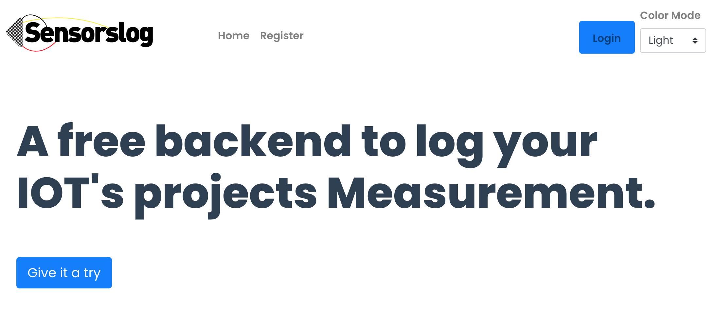

# sensorslog nuxt client



This is a Nuxt project (frontend) which layout is based on Bootstrap Vue. It is the actual client web app to sensorslog.com backend (Laravel). Source here: https://github.com/xavsio4/sensorslog_laravel_backend

Sensorslog is a free platform to log your iot's project data into a database via a Rest Api endpoint.

The usage is quite easy. Register on the platform, generate your public key to access the service, begin posting data from your iot device through the posting endpoint.

You can destroy your account and all your data anytime (privacy by design). The platform is free to use. And if you don't want to use the online service, then make yours.

To help with it, I've made the client source (nuxt), the backend source (Laravel) and an iot example (arduino mkr1000 C++) available through github (https://github.com/xavsio4/sensorslog_laravel_backend and here https://github.com/xavsio4/arduino_mkr1000_temp_log) so you can do whatever you want with it and build your own rest api platform.

It is FAAAAAAAR from being perfect but it worked for me. Clearly, there's room for improvements. I just hope it might help some to bootstrap a web app or to learn from it. What is important are the principles (the recipies of a technology).

Also, feel free to improve this service with pull requests/suggestions/...

## Nuxt Build Setup

Download or fork this repository

then

```bash
# install dependencies
$ npm install

# Then you have to fill .env values.
Most important thing is the base api_url you are going to use. You might have to update the nuxt.config.js file in order for the whole url endpoint to match. For example: your api url might be https://api.yourdomain.com. So, obviously, it is better to install the backend first and test it via https://www.postman.com/ for example.

And in your nuxt.config.js /auth/login. So it means your whole url should be https://api.yourdomain.com/auth/login ...you feel me...

# serve with hot reload at localhost:3000
$ npm run dev

# build for production and launch server
$ npm run build
$ npm run start

# generate static project
$ npm run generate
```

# Then you will have to deploy in your hosting environment

It means that you have to update the .env file with the client ID and SECRET declared on your Laravel Backend (so...yes, you'd better make sure your backend works beforehand)

For detailed explanation on how things work for Nuxt, check out [Nuxt.js docs](https://nuxtjs.org).

## Aknowledgments & credits

Built using NUXT and several official Nuxt's modules
https://nuxtjs.org/

Bootstrap Vue for the UI
https://bootstrap-vue.org/

Used on the registration screen for password strength
https://github.com/apertureless/vue-password-strength-meter

Used for dark mode
https://color-mode.nuxtjs.org/

Used this to animate the logo
https://maxwellito.github.io/vivus-instant/

Background patterns
http://www.heropatterns.com/

For the "back to top" feature (in layout/default.vue)
https://github.com/caiofsouza/vue-backtotop

For cookies consent and gdpr i used this
https://www.npmjs.com/package/nuxt-cookie-control

The Arduino C++ project
https://github.com/xavsio4/arduino_mkr1000_temp_log

The backend of this frontend
https://github.com/xavsio4/sensorslog_laravel_backend
